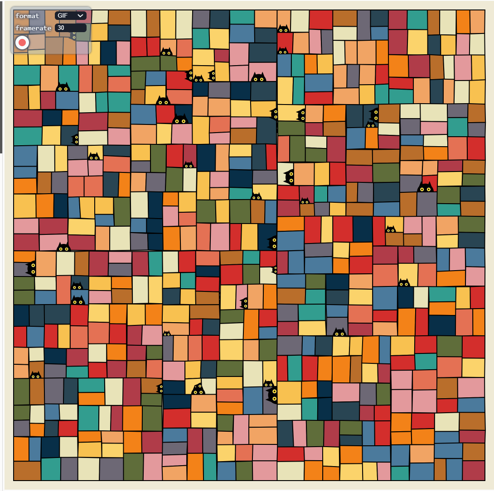
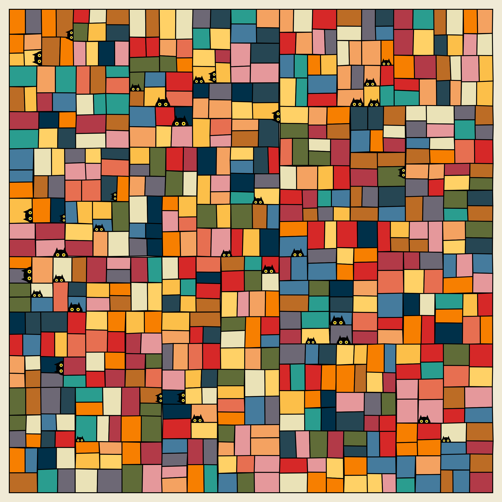
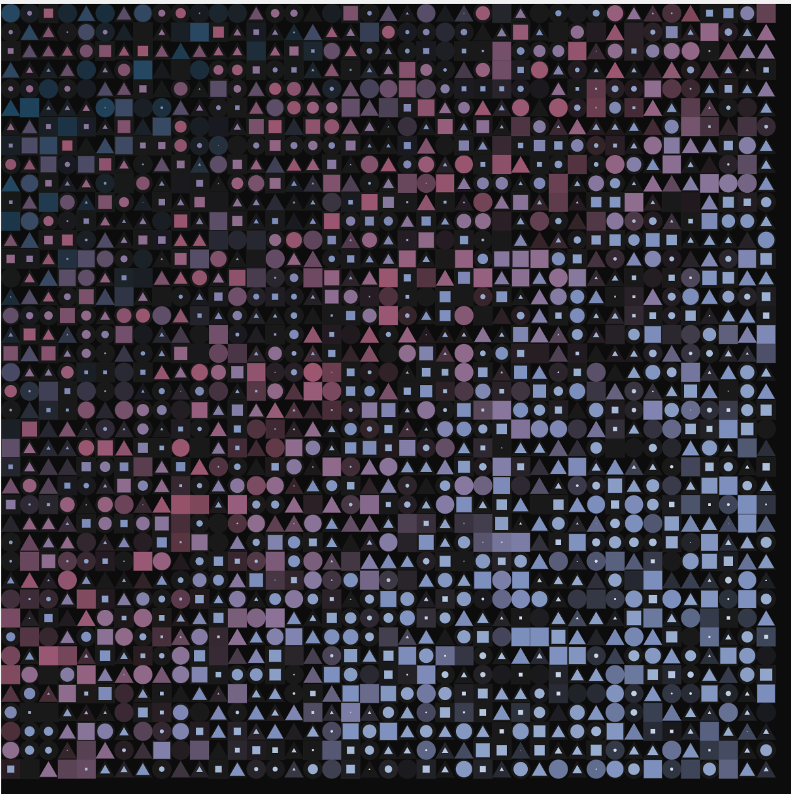
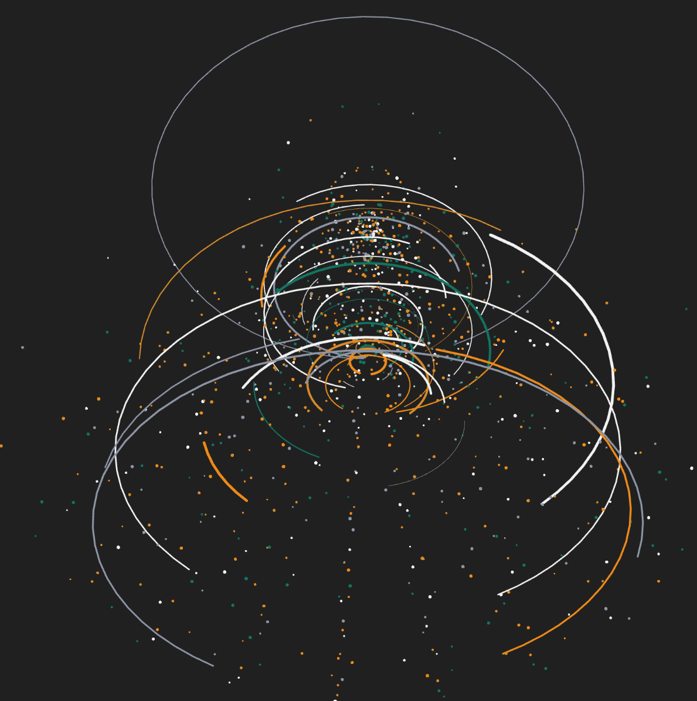
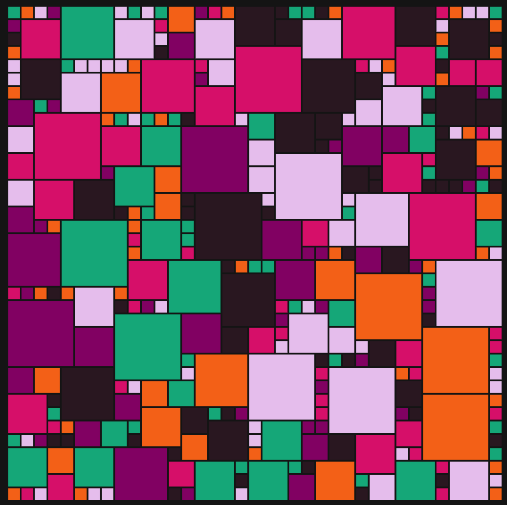
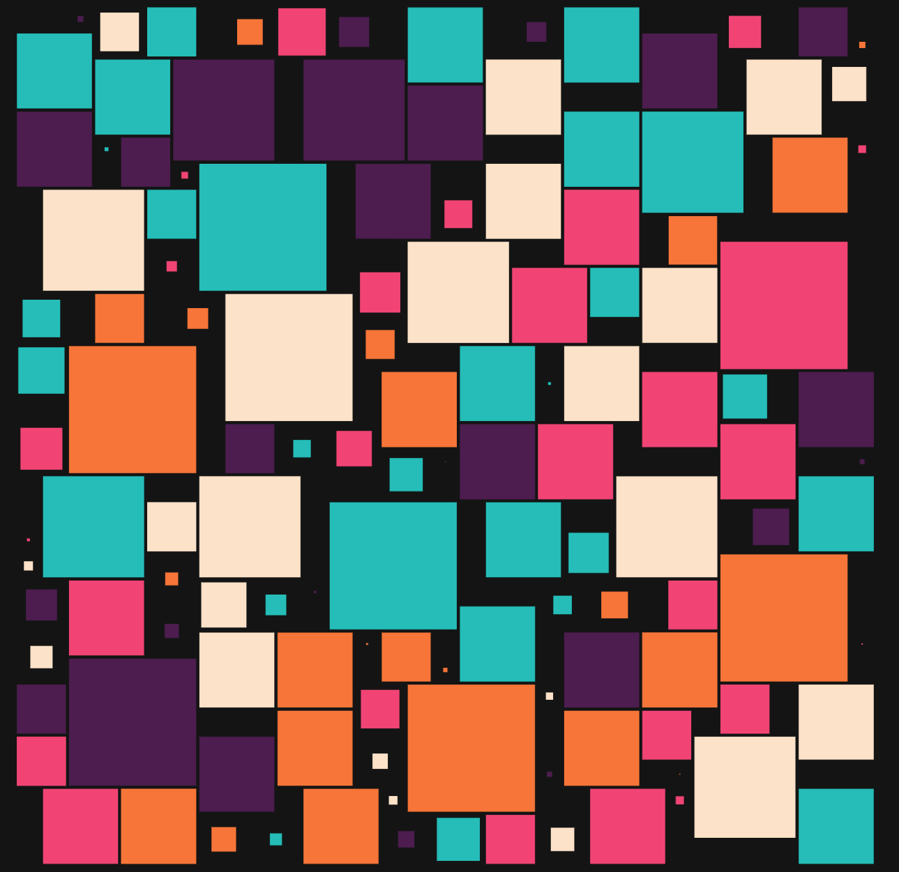

# eniale_idea_9103_tut1

Part 1: Imaging Technique Inspiration

I was inspired by the imaging technique used in the artwork of Manasvi, *Cat Distribution System*
https://editor.p5js.org/manasvihow/sketches/TnI2BDD1Z

The aspect I want to incorporate is the random geometric segmentation of the background, color variations, and the animated emergence of patterns.
This technique is beneficial because it incorporates key concepts from our courses, effectively combining dynamic color variations, controlled pattern generation (with managed quantity and directional appearance), and background music to create a vivid and engaging composition.

Screenshots/Images:

Part 2: Coding Technique Exploration

To achieve this effect, I explored the coding technique like 2D grid modeling，multi-color interpolatio and animated drawing of p5.js.

This approach uses p5.js techniques to create dynamic wallpaper-like animations, geometrically fragmented backgrounds, rhythmic visual transformations, and musical integration, enhancing the work's engagement and artistic quality.

Example Screenshot:

Example Code & Resource Link:

https://openprocessing.org/sketch/2693579

https://openprocessing.org/sketch/2686358

https://openprocessing.org/sketch/2202948